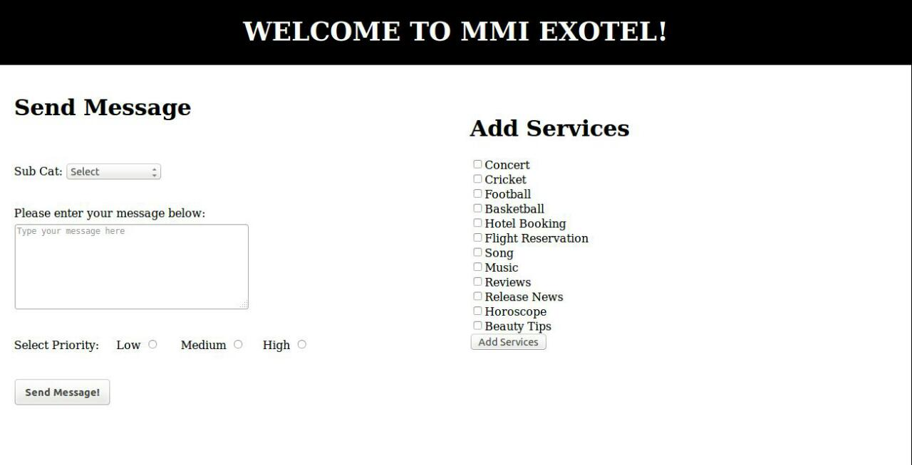
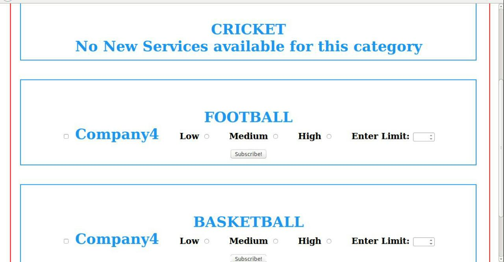
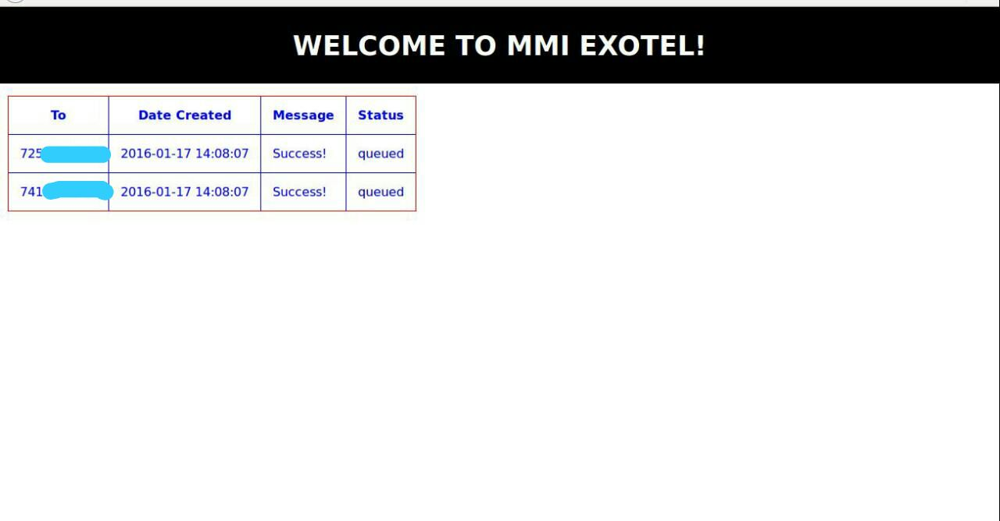
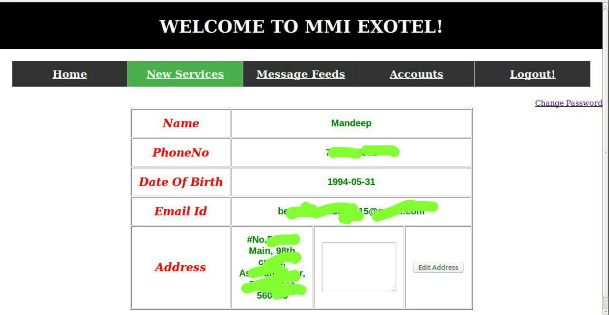

# MMI
##MMI Exotel -  Interface between Organizations and End Users

`Web Application that catered to solve B2C problem in terms of marketing by allowing the Customers to Subscribe to any Business Organization to get important updates from them based on Categories. Implemented using Exotel API’s to send SMS to End-Users. PHP, Ajax, HTML, CSS, Bootstrap , jQuery with MySQL Database was used.`

End Users could customized subscription against different Business Organization spanning across different categories and limit the SMS's that they wish to receive as well. 
Encryption, Registration using OTP, Forgot Password handling using OTP, unsubscribing from the services were also supported.

Screenshots -
 
  
  
  
  
  
